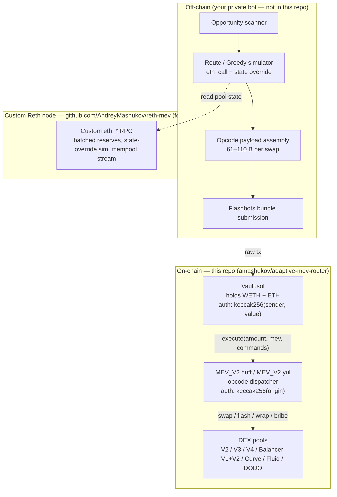

# adaptive-mev-router

Adaptive MEV execution framework — a compact opcode dispatcher implemented in both **Yul** and **Huff**, with on-chain `amountOut` computation, `balanceOf` fallback for intermediate hops, and support for Uniswap V2/V3/V4, Balancer V1+V2, Curve, FluidDex, and DODO.

[](https://github.com/AndreyMashukov/adaptive-mev-router/actions)
[](https://github.com/AndreyMashukov/adaptive-mev-router/actions)
[](https://docs.soliditylang.org/)
[](#)
[](LICENSE)
[](https://github.com/AndreyMashukov/adaptive-mev-router)

A production-flavoured **MEV execution layer** for any EVM chain. The on-chain dispatcher accepts a packed byte-stream of opcodes (1 byte per command, 9–110 bytes per swap) and routes funds through arbitrary multi-hop paths across seven DEX families. Two functionally identical implementations ship in the same repo — a self-contained **Yul** reference and a hand-optimised **Huff** port with an O(1) jump-table dispatch — and the test suite runs every scenario against both, so Yul/Huff parity is enforced by CI on every PR.

The router targets two pain points that hit any non-trivial MEV bot:

1. **Stale amounts.** Classical bots hardcode `amountIn` / `amountOut` into bundle calldata. Between simulation and inclusion the pool state moves; the on-chain numbers no longer match; the tx reverts. This router lets any swap pack `amount_in = 0`, which the dispatcher resolves at execution time via `balanceOf(this, tokenIn)`. For Uniswap V2 hops, `amountOut` is also computed on-chain via `getReserves() + constant product`, with the pool fee passed in calldata (`fee_bps(2)`).
2. **Calldata bloat.** A canonical `swap(uint256,uint256,address,bytes)` call costs ~228 bytes of calldata; this router encodes the same V2 swap in **61 bytes** (~73 % savings, real impact on bundle priority fee).

The companion `RouteSimulatorV2` / `GreedySimulatorV2` Solidity contracts simulate the same dispatcher off-chain (eth_call with state overrides) and emit the exact byte-stream that the on-chain dispatcher will execute — so simulation and execution are guaranteed to round-trip.

## Features

- **Yul + Huff dual implementation** — same dispatcher in two languages, byte-for-byte test parity enforced.
- **Dynamic flash-callback detection** — V2 / V3 / Balancer flash hooks routed by calldata-shape inspection (no per-protocol selector registration). Same rule in Yul, Huff, and the Solidity simulator.
- **Adaptive `amount_in = 0`** — intermediate hops resolve the input via `balanceOf(this, tokenIn)`. No stale amounts between simulate and execute.
- **On-chain V2 `amountOut`** — `getReserves() + constant product + fee_bps` computed in the dispatcher; calldata carries only the fee, never the (volatile) output amount.
- **Seven DEX families** — Uniswap V2 / V3 / V4, Balancer V1 / V2, Curve, FluidDex, DODO.
- **Compact opcode set** — 31 opcodes in a packed jump table (`0x00`–`0x1E`); ~9–110 bytes per command.
- **Flash-loan opcodes** — V2 / V3 flash-swap, V4 `unlock`, with nested inner programs.
- **Multi-operator auth** — 11 operator slots (10 EOA + 1 Vault), selected by priority-fee low 4 bits, authenticated against `keccak256(origin)` hashes baked into immutable storage.
- **Off-chain simulator parity** — `RouteSimulatorV2` reproduces the dispatcher in Solidity for `eth_call` simulation; `GreedySimulatorV2` allocates a flash-borrow greedily across parallel routes.
- **Generic `ReserveReader`** — single contract that batches reserves for all seven DEX types (deploy via state override and one call returns everything).
- **Zero runtime dependencies** — no OpenZeppelin, no token libs, just `ext-*` opcodes. Inline interfaces only.
- **MIT licensed.**

## Why adaptive-mev-router

Most public MEV scaffolding is either toy (one DEX, one swap, illustrative only) or hard-locked to a single proprietary opcode format with no off-chain simulator counterpart. This repo ships:

- A **complete** opcode set covering the seven DEX families that actually carry meaningful MEV flow on mainnet,
- A **parallel** implementation in two languages (Yul + Huff), tested side-by-side so any divergence breaks CI,
- An **off-chain simulator** that emits the same byte-stream, so you can run state-override simulations and trust that what executed on-chain matches what was simulated,
- A **gas-reporter PR check** so every code change has its real cost made visible on the PR.

Use it as a learning artefact for opcode-dispatcher design, as a starting point for your own MEV stack, or as the on-chain piece of a private off-chain bot.

## Architecture



Off-chain bot constructs the byte-stream, simulates it via the custom Reth node, submits a Flashbots bundle that calls `Vault.execute(amount, mevBot, commands)`. The Vault funds the MEV contract with WETH and forwards `commands` to it; the MEV contract dispatches opcodes against the DEX pools.

## Yul / Huff parity

Both `MEV_V2.yul` and `MEV_V2.huff` implement the exact same opcode set. The test suite (`test/MEV_V2.test.js`) compiles both, loads them as two `variant` objects, and runs **every** test against both — Yul/Huff parity is enforced by the test runner, not by code review:

```js
function loadVariants() {
  // Yul artifact must exist (hardhat compile); huffc must have produced runtime bin.
  // Missing huff binary => hard fail; we do NOT silently skip the Huff variant.
  const huffBinPath = path.join(__dirname, "..", "artifacts", "MEV_V2_huff.bin");
  if (!fs.existsSync(huffBinPath)) throw new Error("...install huffc and rebuild...");

  return [
    { name: "Yul",  abi, bytecode: yulBytecode },
    { name: "Huff", abi, bytecode: wrapRuntimeBytecode(huffRuntime) },
  ];
}

loadVariants().forEach((variant) => {
  describe(`MEV_V2 [${variant.name}]`, function () {
    // ... every test runs twice — once for Yul, once for Huff
  });
});
```

If the Huff port and Yul reference ever drift in behaviour — different stack-balance bug, different memory layout, different opcode interpretation — the CI run goes red. This is the single most valuable thing about the repo: an executable specification of the dispatcher that two independent implementations must satisfy. The fork tests use the same `forEach(variant)` pattern (`test/MEV_V2_v4_nested.fork.test.js`) so V4 nested unlock semantics are checked against both implementations too.

Local run after `huffc contracts/MEV_V2.huff -r > artifacts/MEV_V2_huff.bin`:

```
114 passing (7s)      # 57 cases × 2 variants
```

## Opcode dispatcher

The byte-stream is parsed at offset 0. Each command starts with a 1-byte opcode followed by a fixed-size payload. The dispatcher loops until the cursor reaches `callvalue()` (which carries the byte-length).

| Op | Name | Size | Layout |
|----|------|------|--------|
| 0x00 | `v2_swap_zfo` | 61 B | op(1) + sel(4) + fee_bps(2) + pair(20) + tokenIn(20) + amountIn(14) |
| 0x01 | `v2_swap_ofz` | 61 B | same |
| 0x02 | `v3_swap_zfo` | 79 B | op(1) + sel(4) + token0(20) + token1(20) + pool(20) + amountIn(14) |
| 0x03 | `v3_swap_ofz` | 79 B | same |
| 0x04 | `bal_swap_zfo` | 111 B | op(1) + sel(4) + vault(20) + poolId(32) + token0(20) + token1(20) + amountIn(14) |
| 0x05 | `bal_swap_ofz` | 111 B | same |
| 0x06 | `curve_zfo` | 71 B | op(1) + sel(4) + pool(20) + idx0(6) + idx1(6) + tokenIn(20) + amountIn(14) |
| 0x07 | `curve_ofz` | 71 B | same |
| 0x08 | `wrap_weth` | 15 B | op(1) + amount(14). `0` → `selfbalance()` |
| 0x09 | `bribe` | 10 B | op(1) + amount(9) → `block.coinbase.transfer(...)` |
| 0x0A | `unwrap_weth` | 15 B | op(1) + amount(14). `0` → `balanceOf(WETH)` |
| 0x0B | `transfer_eth` | 35 B | op(1) + amount(14) + addr(20) |
| 0x0C | `transfer_erc20` | 55 B | op(1) + token(20) + addr(20) + amount(14) |
| 0x0D | `balance_check` | 55 B | op(1) + addr(20) + token(20) + minAmount(14) |
| 0x0E | `sweep` | 41 B | op(1) + token(20) + to(20) — transfer full balance |
| 0x10 | `v2_flash_z` | 42 B + inner | op(1) + sel(4) + amount(14) + pair(20) + innerLen(3) + inner(bytes) |
| 0x11 | `v2_flash_o` | 42 B + inner | same |
| 0x12 | `v3_flash_swap_z` | 42 B + inner | same (pool) |
| 0x13 | `v3_flash_swap_o` | 42 B + inner | same |
| 0x14 | `v4_unlock` | var | op(1) + pm(20) + innerLen(3) + inner(bytes) |
| 0x15 | `v4_swap_zfo` | var | inside `v4_unlock` |
| 0x16 | `v4_swap_ofz` | var | inside `v4_unlock` |
| 0x17 | `v4_settle` | var | inside `v4_unlock` |
| 0x18 | `v4_take` | var | inside `v4_unlock` |
| 0x19 | `bal_v1_zfo` | 79 B | op(1) + sel(4) + pool(20) + tokenIn(20) + tokenOut(20) + amountIn(14) |
| 0x1A | `bal_v1_ofz` | 79 B | same |
| 0x1B | `fluid_zfo` | 59 B | op(1) + sel(4) + pool(20) + tokenIn(20) + amountIn(14) |
| 0x1C | `fluid_ofz` | 59 B | same |
| 0x1D | `dodo_zfo` | 59 B | op(1) + sel(4) + pool(20) + tokenIn(20) + amountIn(14) |
| 0x1E | `dodo_ofz` | 59 B | same |

`amountIn = 0` triggers the `balanceOf(this, tokenIn)` fallback in every swap opcode; `wrap_weth(0)` → `selfbalance()`; `unwrap_weth(0)` → `balanceOf(WETH)`.

### Calldata savings

| DEX | Conventional ABI encode | This router | Savings |
|---|---:|---:|---:|
| Uniswap V2 swap | ~228 B | **61 B** | 73 % |
| Uniswap V3 swap (with init bytes) | ~260 B | **79 B** | 70 % |
| Balancer V2 swap | ~388 B | **111 B** | 71 % |
| Curve `exchange` | ~196 B | **71 B** | 64 % |
| `wrap_weth` | ~36 B | **15 B** | 58 % |
| `unwrap_weth` | ~36 B | **15 B** | 58 % |

(Lower bound — conventional encoding includes 4-byte selector + 32-byte head per dynamic argument. Real bundles often include several swaps, multiplying the saving.)

### Gas (measured)

Numbers below are end-to-end transaction gas (entry → opcode dispatch → swap → return) measured against the mock pools in `contracts/mocks/`, Solidity 0.8.28 + EVM Cancun + `viaIR` + optimizer `runs=200`. Reproduce locally:

```bash
npm run test:gas
```

CI re-runs this on every PR and posts a diff comment against the base branch (`.github/workflows/ci.yml` → `gas-report` job).

**Per-opcode (single command per transaction):**

| Opcode | Operation | `amount > 0` | `amount = 0` (adaptive) |
|---|---|---:|---:|
| `0x00` | Uniswap V2 swap, zeroForOne | 82 164 | **65 707** |
| `0x01` | Uniswap V2 swap, oneForZero | 86 983 | 82 826 |
| `0x02` | Uniswap V3 swap, zeroForOne | 60 996 | **56 851** |
| `0x03` | Uniswap V3 swap, oneForZero | 56 301 | 74 056 |
| `0x04` | Balancer V2 swap, zeroForOne | 81 280 | 81 794 |
| `0x05` | Balancer V2 swap, oneForZero | 81 721 | **68 132** |
| `0x06` | Curve swap, zeroForOne | 87 080 | 87 595 |
| `0x07` | Curve swap, oneForZero | 88 975 | **73 935** |
| `0x08` | `wrap_weth` | 55 060 | **37 907** (`selfbalance`) |
| `0x09` | `bribe` (coinbase transfer) | — | 28 539 |
| `0x0A` | `unwrap_weth` | 38 266 | **34 097** (full WETH bal) |
| `0x0B` | `transfer_eth` | — | 31 454 |
| `0x0C` | `transfer_erc20` | — | 50 249 |
| `0x0D` | `balance_check` | — | 27 756 |
| `0x0E` | `sweep` (full balance) | — | 33 775 |
| `0x19` | Balancer V1 swap, zeroForOne | 82 216 | 82 730 |
| `0x1A` | Balancer V1 swap, oneForZero | 82 880 | **69 059** |
| `0x1B` | FluidDex swap, zeroForOne | 71 591 | 72 234 |
| `0x1C` | FluidDex swap, oneForZero | 76 428 | **55 171** |
| `0x1D` | DODO swap, zeroForOne | 85 695 | 86 338 |
| `0x1E` | DODO swap, oneForZero | 90 555 | **69 298** |

The `amount=0` (adaptive) column is the realistic per-hop cost inside a multi-hop route: the value-add of this dispatcher comes from chaining several such hops in a single tx without re-encoding intermediate amounts.

**End-to-end multi-hop scenarios:**

| Scenario | Gas |
|---|---:|
| V2 flash → V2 inner → sweep repay (2-hop) | 100 626 |
| V3 flash-swap → V2 inner → sweep repay (2-hop) | 91 495 |
| V2 flash 3-hop triangle (V2 → V2 → V2 → repay) | 146 486 |
| Greedy simulator E2E: V2 flash 2-hop | 127 866 |
| Greedy simulator E2E: V3 flash 2-hop | 101 086 |
| Greedy simulator E2E: V2 flash 3-hop | 155 620 |
| Mixed V2 flash + V3 inner | 101 867 |
| Sandwich backrun (`amount=0` + balance_check + sweep) | 89 950 |
| Pipeline `v2_swap + sweep` | 77 581 |
| Wrap + ERC20 transfer | 66 952 |

**Yul vs Huff (same test, both implementations):**

Every test runs against both variants via `loadVariants().forEach(...)` in `test/MEV_V2.test.js`. Huff's O(1) jump-table dispatch is consistently faster on dispatcher-heavy ops; on I/O-dominated swaps the two are within a handful of gas.

| Operation | Yul | Huff | Δ |
|---|---:|---:|---:|
| `0x02` V3 swap zfo (`amount=0`) | 56 851 | 56 800 | −51 |
| `0x04` Balancer V2 zfo (`amount=0`) | 81 794 | 81 644 | −150 |
| `0x08` `wrap_weth` (adaptive) | 37 907 | 37 782 | −125 |
| `0x0A` `unwrap_weth` (adaptive) | 34 097 | 33 921 | −176 |
| `0x0B` `transfer_eth` | 31 454 | 31 290 | −164 |
| `0x0C` `transfer_erc20` | 50 249 | 50 009 | −240 |
| `0x0D` `balance_check` | 27 756 | 27 504 | −252 |
| `0x0E` `sweep` | 33 775 | 33 458 | −317 |
| `0x19` Balancer V1 zfo (`amount=0`) | 82 730 | 82 257 | −473 |
| `0x1A` Balancer V1 ofz | 82 880 | 82 313 | −567 |
| `0x1B` Fluid zfo (`amount=0`) | 72 234 | 71 624 | −610 |
| `0x1C` Fluid ofz (`amount=0`) | 55 171 | 54 535 | −636 |
| `0x1D` DODO zfo (`amount=0`) | 86 338 | 85 696 | −642 |
| `0x1E` DODO ofz (`amount=0`) | 69 298 | 68 640 | −658 |
| V2 flash 3-hop chain | 146 486 | 145 781 | −705 |
| Sandwich backrun (resolve + check + sweep) | 89 950 | 89 152 | −798 |

(Δ = `Huff − Yul`; negative means Huff is cheaper. Both implementations pass byte-for-byte the same 57 test scenarios — only the gas footprint differs.)

## Dynamic flash-callback detection

DEX flash hooks (`uniswapV2Call`, `uniswapV3SwapCallback`, the Balancer / Aave variants) all hand control back to the recipient via different function signatures and different calldata layouts. A naive contract registers a dedicated selector for each. This dispatcher does not — both `MEV_V2.yul` (lines 37–67) and `RouteSimulatorV2Base.sol` (`fallback`, line 390) **detect the callback type by inspecting calldata shape**:

- **V2 layout:** `uniswapV2Call(address, uint256, uint256, bytes)` — the dynamic `bytes` offset sits at `calldata[100..132]`, and `dataStart + paddedLength` must equal `calldatasize`.
- **V3 layout:** `uniswapV3SwapCallback(int256, int256, bytes)` — the `bytes` offset sits at `calldata[68..100]`, same length check.

The fallback peeks at the relevant offset, validates the length math, and dispatches to `_v2Callback` or `_v3Callback`. The same logic in Yul lives in the runtime entry-point:

```yul
if iszero(lt(calldatasize(), 164)) {
    let v2_off := calldataload(100)
    let v2_data_pos := add(4, v2_off)
    if iszero(gt(add(v2_data_pos, 32), calldatasize())) {
        let v2_len := calldataload(v2_data_pos)
        let v2_padded := mul(div(add(v2_len, 31), 32), 32)
        if eq(add(add(v2_data_pos, 32), v2_padded), calldatasize()) {
            v2_flash_callback(add(v2_data_pos, 32))
            return(0, 0)
        }
    }
}
// then try V3 layout the same way
```

Two consequences:

1. The dispatcher works against any flash protocol whose callback uses one of those two layouts (Uniswap V2 / SushiSwap / PancakeSwap / Balancer V2 batch / V3 forks) **without** declaring a selector for each.
2. Adding a new flash protocol is a one-line change: if a third layout shows up, append another `if iszero(lt(calldatasize(), N)) { ... }` branch.

The simulator (Solidity) and the on-chain dispatcher (Yul/Huff) share the same detection rule, so what callback path a simulation took is exactly the path the on-chain tx takes.

## Authorization

The dispatcher uses a **priority-fee-as-operator-index** scheme. The transaction's `(gasprice - basefee) & 0xF` selects one of 16 operator slots (currently 11 are wired — `0x00`–`0x0A`). Each slot stores a pre-computed hash that the contract compares against `keccak256(tx.origin)`. If `tx.origin` does not match the slot's hash, the call reverts.

Two contracts, two slightly different hashes:

| Contract | Hash formula |
|---|---|
| `MEV_V2.huff` / `MEV_V2.yul` | `keccak256(abi.encode(operatorAddress))` — 32-byte left-padded address |
| `Vault.sol` | `keccak256(abi.encodePacked(operatorAddress, uint256(index)))` — address + slot index |

The Vault separately checks `keccak256(msg.sender, msg.value)` (it uses `msg.value` as the operator index) so a bot can only refill / sweep using a recognised operator EOA.

### ⚠️ Replace before deploy

The repo ships with **placeholder operator addresses** for testing:

| Slot | Placeholder address | Purpose |
|---|---|---|
| 0 | `0x0000000000000000000000000000000000000001` | EOA operator 0 |
| 1 | `0x0000000000000000000000000000000000000002` | EOA operator 1 |
| 2 | `0x0000000000000000000000000000000000000003` | EOA operator 2 |
| 3 | `0x0000000000000000000000000000000000000004` | EOA operator 3 |
| 4 | `0x0000000000000000000000000000000000000005` | EOA operator 4 |
| 5 | `0x0000000000000000000000000000000000000006` | EOA operator 5 |
| 6 | `0x0000000000000000000000000000000000000007` | EOA operator 6 |
| 7 | `0x0000000000000000000000000000000000000008` | EOA operator 7 |
| 8 | `0x0000000000000000000000000000000000000009` | EOA operator 8 |
| 9 | `0x000000000000000000000000000000000000000A` | EOA operator 9 |
| 10 | `0x000000000000000000000000000000000000000B` | Vault contract |

**Before any production deploy**, regenerate the OP_HASH constants for your real operator addresses:

```bash
node scripts/compute_op_hashes.js 0xYourOp0 0xYourOp1 ... 0xYourOp9 0xYourVault
```

The script prints three blocks — paste them into `MEV_V2.huff`, `MEV_V2.yul`, and `Vault.sol` constructor respectively.

## Install / Build

### Docker (reproducible, recommended)

```bash
docker build -t adaptive-mev-router .
docker run --rm adaptive-mev-router            # runs unit suite (Yul + Huff foreach)
```

The image bundles Node 22, hardhat, and `huffc` (pinned to the `nightly` huff-rs release that publishes Linux binaries — the tagged 0.3.2 has none). Same flow CI uses.

### Native

```bash
git clone https://github.com/AndreyMashukov/adaptive-mev-router.git
cd adaptive-mev-router
npm ci

# Solidity + Yul:
npx hardhat compile

# huffc — install once (Linux amd64; for macOS use the matching huff_nightly_darwin_* asset):
curl -fsSL -o /tmp/huff.tar.gz \
  https://github.com/huff-language/huff-rs/releases/download/nightly/huff_nightly_linux_amd64.tar.gz
mkdir -p /tmp/huff && tar -xzf /tmp/huff.tar.gz -C /tmp/huff
sudo mv $(find /tmp/huff -name huffc -type f) /usr/local/bin/huffc

# Build huff runtime bytecode (required — tests hard-fail without it):
mkdir -p artifacts
huffc contracts/MEV_V2.huff -r > artifacts/MEV_V2_huff.bin
```

## Usage

Unit tests deploy `MEV_V2` directly and exercise opcodes against the mock pools shipped in `contracts/mocks/`:

```bash
npm run test            # full suite (Yul + Huff variants)
npm run test:unit       # unit tests only (~5–10 s)
npm run test:fork       # mainnet fork tests (needs MAINNET_RPC_URL or uses public default)
npm run test:gas        # with hardhat-gas-reporter
```

Minimal payload to wrap WETH and run a single V2 swap:

```
[0x08, amount(14)] +                              // wrap_weth
[0x00, sel(4), feeBps(2), pair(20), tokenIn(20), amountIn=0(14)]
```

`callvalue` equals the byte-length of the program; the dispatcher loops while `cursor < callvalue`.

See `test/MEV_V2.test.js` for ~100 worked examples.

## Related repositories

| Repo | Role |
|------|------|
| [`amashukov/reth-mev`](https://github.com/AndreyMashukov/reth-mev) [](https://github.com/AndreyMashukov/reth-mev/actions) | Custom Reth node (v1.11.1) with extended `mev_` RPC: flash arbitrage / sandwich / backrun search executed in-process against live MDBX state via revm |
| [`amashukov/eth-rpc-client-php`](https://github.com/AndreyMashukov/eth-rpc-client-php) | ethers.js-style typed JSON-RPC client (PHP), useful for off-chain bot scaffolding from non-Rust stacks |

## Quality

- **Solidity 0.8.28**, EVM `cancun`, `viaIR`, optimizer `runs=200`.
- **Yul + Huff parity** enforced — every test runs against both, CI red on divergence.
- **Hardhat test suite** — `test/MEV_V2.test.js` (~100 cases), `test/RouteSimulatorV2.test.js` (~50 cases). Fork tests under `*.fork.test.js`.
- **GitHub Actions CI** — unit + fork + gas-diff PR comment.
- **Zero external runtime dependencies** — no token libs, no math libs. Just `ext-*` opcodes and inline interfaces.
